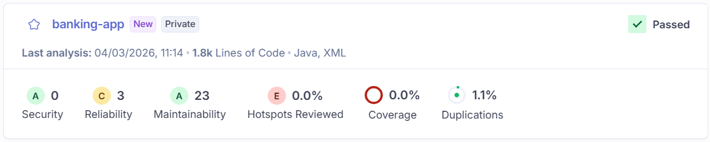

# Memoria de Análisis de Calidad de Código (Práctica 2)

## 1. Información del Grupo
* **Nombre del Grupo:** Grupo 2
* **Miembros:**
    * Marcos García García
    * Narao Martín Simón
    * Alberto Mayoral Gómez
    * Icíar Moreno López
    * Adrián Muñoz Serrano
    * Jorge Padilla Rodríguez
    * Laura Pineda Ballesteros

---

## 2. Dashboard de SonarCloud (Análisis Inicial)
Captura de pantalla del **dashboard** (Overview) de SonarCloud donde se visualizan las métricas principales tras el primer análisis.

---

## 3. Detección y Análisis de Bad Smells
A continuación, se detallan los problemas detectados en la clase `AccountService.java` mediante el uso de SonarCloud e inspección manual.

### Issue 1: [Nombre de la issue, p.e. Duplicación de código en X método]
* **Ubicación:** `AccountService.java` - Línea [Indicar línea/s]
* **Reporte de la issue:**
    > **Nota:** Si se detectó con SonarCloud, adjuntar captura de la issue en la plataforma. Si fue manual, adjuntar captura del código resaltado.
    

* **Explicación del mal olor:**
    [Escribir aquí la explicación basada en los conceptos de la asignatura]

    * Si fue detectado por SonarCloud, **¿Problema real o Falso positivo?**

### Issue 2: [Nombre de la issue, p.e. Duplicación de código en X método]
* **Ubicación:** `AccountService.java` - Línea [Indicar línea/s]
* **Reporte de la issue:**
    > **Nota:** Si se detectó con SonarCloud, adjuntar captura de la issue en la plataforma. Si fue manual, adjuntar captura del código resaltado.
    

* **Explicación del mal olor:**
    [Escribir aquí la explicación basada en los conceptos de la asignatura]

    * Si fue detectado por SonarCloud, **¿Problema real o Falso positivo?**

---

## **Refactorización**

NO REALIZAR EN ESTA PRÁCTICA